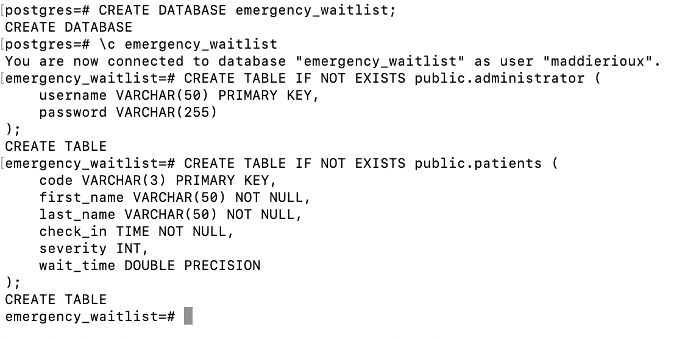

# emergency_waitlist

This is the Emergency Waitlist program from Group 23

From the developer's perspective: 

To begin you will need to Create the database in Postgres. This can be done by running the Setup.sql within Postgres as shown below.:

You will want to ensure You have copied and pasted the entire document!

You will then navigate to the config.php where it says within the code:

$host = 'localhost';

$db = 'emergency_waitlist';

$user = 'postgres';

$password = 'postgres';

you will want to replace the $user and $password with the username and password of your Postgres account!!

Then you will want to open a terminal at the folder and type the following code: php -S localhost:8000

then open a browser and open http://localhost:8000

Within Setup.sql we initialized there to be an admin with the username: admin_user and password: password.

You can use those to log in to the admin site. 

From the admin Site, you can update the status of a patient, add a new patient (Check-in a patient), or delete a patient (Check-out a patient).

When a patient is deleted or their status is changed from waiting, the wait time of the other patients will be updated accordingly.

The wait time for each patient is calculated by 10*severity of injury of every person waiting in front of them.

You can also log in via the patient site using the first name and last name of a patient as well as the code given to see the wait time. An example would be 'Bob' 'Browns' 'A04'

